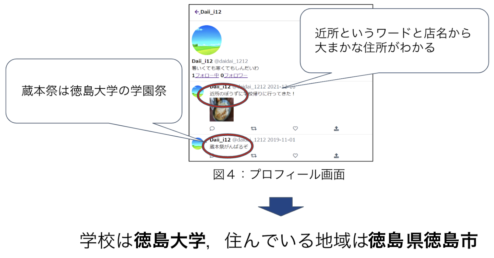

# 情報リテラシー教育のための個人情報調査アプリケーション

このアプリケーションの目的は、「ネットに情報発信をする際に気を付けるべき箇所を知る機会を与えること」だ。<br>
具体的には、仮想の SNS 上で、学習者に投稿などから架空のユーザーの個人情報を特定してもらう。<br>
本アプリケーションで個人情報の特定方法を学ぶことで、どのような情報が個人情報の特定に必要なのかわかるようになっていく。<br>
どのような情報が個人情報の特定に必要なのかが分かれば、学習者が実際の SNS を使う際にそのような情報は投稿してはならないと考えるようになるのではないか、それにより SNS の個人情報特定被害を減らすことができるのではないかという仮説によって開発された。

# DEMO



# Features

SNS の情報リテラシーの授業をするとなった際に実際のアプリケーションを用いて行うとなるとアカウントを複数作ることが手間である．また，教育ツールとして使うにも問題を解く過程で便利な機能というものも少ないと思われる．これらのことから実際の SNS をモデルとした教育支援アプリケーションの必要性を考えた．

# Requirement

- ruby '2.6.5'
- rails, '~> 5.2.6'

# Usage

```bash
git clone https://github.com/ajipon-44/soturon
docker-compose build
docker-compose up
```

# Note

※デプロイしてません

- 教師用画面 URL
  http://localhost:3000/teacher/index

- 生徒用画面 URL
  http://localhost:3000/
